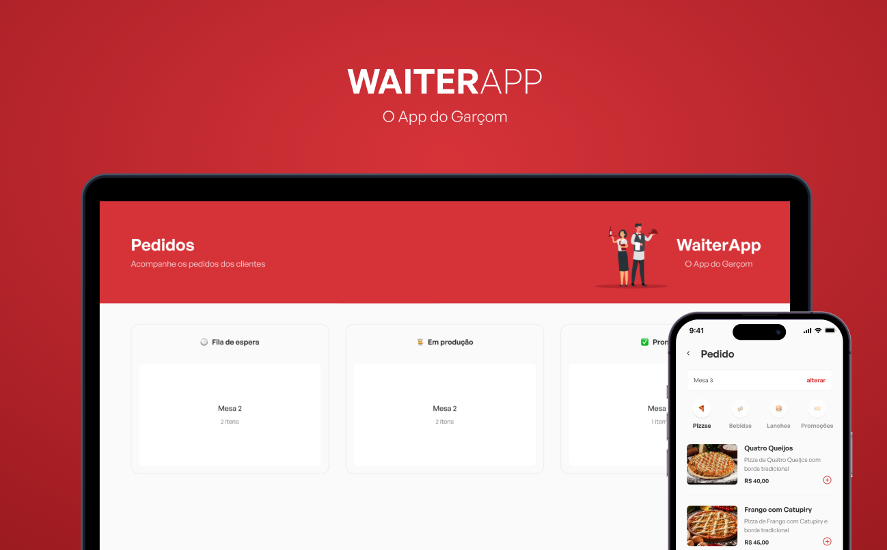

<h2>💡️ About</h2>
Waiter-app is a facility for restaurants to manage customer orders. The waiter will be able to take customer orders and the cooks will be able to see them on the kitchen TV.
 
 
Divided by categories, it's easier to select the foods the customer wants to order. And at the kitchen, the cooks can see with details what the order consists and manage the order's progress.

<h2>💻️ Techonologies</h2>
This application consists in a web and mobile apps. They were developed using:

- NodeJS
- MongoDB
- Docker
- ReactJS
- React Native
- TypeScript
